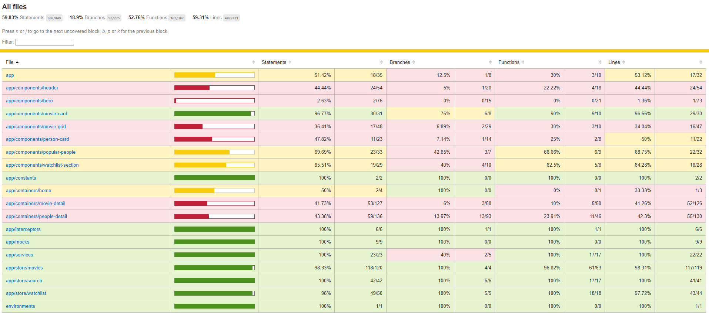

# Movie Discovery App Documentation

## Table of Contents

1. [Project Overview](#project-overview)
2. [Architecture](#architecture)
3. [Getting Started](#getting-started)
4. [Project Structure](#project-structure)
5. [Components Documentation](#components-documentation)
6. [State Management](#state-management)
7. [Services](#services)
8. [Models](#models)
9. [Testing](#testing)
10. [Deployment](#deployment)
11. [API Reference](#api-reference)
12. [Contributing](#contributing)

## Project Overview

### Description

MuviCoop is a modern Angular-based movie discovery application that helps users find their next favorite movie. The app integrates with The Movie Database (TMDB) API to provide comprehensive movie information, search functionality, and personalized watchlists.

### Features

- **Movie Search**: Search for movies and people with real-time suggestions
- **Category Browsing**: Discover movies by mood (Feel Good, Action, Mind Benders)
- **Movie Details**: Comprehensive movie information including cast, crew, reviews, and trailers
- **Watchlist Management**: Save movies for later viewing with local storage persistence
- **Responsive Design**: Mobile-first design that works across all devices
- **Featured Carousel**: Auto-rotating showcase of popular movies
- **Popular People**: Browse trending actors and directors

### Technology Stack

- **Frontend**: Angular 18+ with standalone components
- **State Management**: NgRx (Actions, Reducers, Effects, Selectors)
- **Styling**: Bootstrap 5 with custom SCSS
- **Icons**: Font Awesome
- **HTTP Client**: Angular HttpClient with custom interceptors
- **Testing**: Jasmine & Karma
- **Build Tool**: Angular CLI
- **Deployment**: GitHub Pages

## Architecture

### High-Level Architecture

```
┌─────────────────┐    ┌─────────────────┐    ┌─────────────────┐
│   Components    │    │   State Mgmt    │    │    Services     │
│                 │    │                 │    │                 │
│ • Header        │◄──►│ • NgRx Store    │◄──►│ • Movie Service │
│ • Hero          │    │ • Actions       │    │ • HTTP Client   │
│ • Movie Cards   │    │ • Reducers      │    │ • Interceptors  │
│ • Movie Detail  │    │ • Effects       │    │                 │
│ • Person Detail │    │ • Selectors     │    │                 │
└─────────────────┘    └─────────────────┘    └─────────────────┘
        │                       │                       │
        └───────────────────────┼───────────────────────┘
                                │
                    ┌─────────────────┐
                    │   TMDB API      │
                    │                 │
                    │ • Movies        │
                    │ • People        │
                    │ • Search        │
                    │ • Images        │
                    └─────────────────┘
```

### Component Architecture

```
App Component
├── Header Component
│   ├── Search Functionality
│   └── Navigation
├── Router Outlet
│   ├── Home Page
│   │   ├── Hero Component
│   │   ├── Movie Grid Component
│   │   ├── Watchlist Section Component
│   │   └── Popular People Component
│   ├── Movie Detail Page
│   └── People Detail Page
└── Footer
```

### State Management Flow

```
User Action → Component → Action → Effect → API Call → Success/Failure → Reducer → State Update → Component Update
```

## Getting Started

### Prerequisites

- Node.js (v18 or higher)
- npm or yarn
- Angular CLI (`npm install -g @angular/cli`)

### Installation

```bash
# Clone the repository
git clone https://github.com/your-username/movie-discover-app.git

# Navigate to project directory
cd movie-discover-app

# Install dependencies
npm install

# Start development server
ng serve

# Open browser
http://localhost:4200
```

### Environment Setup

1. Get TMDB API key from [The Movie Database](https://www.themoviedb.org/settings/api)
2. Update `src/environments/environment.ts`
3. update the href in index file

```typescript
export const environment = {
  production: false,
  tmdbApiKey: "YOUR_API_KEY_HERE",
  tmdbBaseUrl: "https://api.themoviedb.org/3",
};
```

## Project Structure

```
src/
├── app/
│   ├── components/           # Reusable UI components
│   │   ├── header/
│   │   ├── hero/
│   │   ├── movie-card/
│   │   ├── movie-grid/
│   │   ├── person-card/
│   │   ├── popular-people/
│   │   └── watchlist-section/
│   ├── containers/           # Page-level components
│   │   ├── home/
│   │   ├── movie-detail/
│   │   └── people-detail/
│   ├── store/               # NgRx state management
│   │   ├── movies/
│   │   ├── search/
│   │   └── watchlist/
│   ├── services/            # Business logic & API calls
│   ├── models/              # TypeScript interfaces
│   ├── constants/           # App constants
│   ├── interceptors/        # HTTP interceptors
│   └── mocks/              # Test mocks
├── assets/                  # Static assets
├── environments/           # Environment configurations
└── styles.scss             # Global styles
```

## Components Documentation

### Header Component

**Purpose**: Navigation and search functionality

**Inputs**:

- `searchType: SearchType` - Current search type (movie/person)
- `loading: boolean` - Loading state
- `movieResults: Movie[]` - Movie search results
- `actorResults: Person[]` - Actor search results
- `searchResults: SearchItem[]` - Combined search results

**Outputs**:

- `currentSearch: EventEmitter<string>` - Search query changes
- `searchTypeUpdate: EventEmitter<SearchType>` - Search type changes
- `onClearSearch: EventEmitter<void>` - Clear search trigger
- `selectedItem: EventEmitter<SearchItem>` - Item selection
- `redirectHome: EventEmitter<void>` - Home navigation

**Key Features**:

- Debounced search (300ms delay)
- Real-time search suggestions
- Keyboard navigation support
- Responsive dropdown

**Usage**:

```html
<app-header [searchType]="currentSearchType" [loading]="searchLoading$ | async" [movieResults]="movieResults$ | async" [actorResults]="actorResults$ | async" [searchResults]="searchResults" (currentSearch)="updateSearchInput($event)" (searchTypeUpdate)="updateSearchType($event)" (onClearSearch)="clearSearch()" (selectedItem)="navigateToSelection($event)" (redirectHome)="redirectToHome()" />
```

### Hero Component

**Purpose**: Landing page hero section with featured movies and category selection

**Key Features**:

- Auto-rotating movie carousel (5-second intervals)
- Image preloading for smooth transitions
- Category selection (Feel Good, Action, Mind Benders)
- Responsive design

**State Dependencies**:

- `popularMovies$` - Featured movies data
- `popularMoviesLoading$` - Loading state

**Methods**:

- `selectCategory(category)` - Handle category selection
- `goToSlide(index)` - Manual carousel navigation
- `viewMovieDetails(movieId)` - Navigate to movie details

### Movie Card Component

**Purpose**: Reusable movie display card

**Inputs**:

- `movie: Movie` - Movie data (required)
- `showQuickActions: boolean` - Show hover actions (default: true)

**Features**:

- Image lazy loading
- Watchlist toggle
- Rating display
- Responsive hover effects
- Accessibility support

**Usage**:

```html
<app-movie-card [movie]="movieData" [showQuickActions]="true" />
```

### Movie Detail Page

**Purpose**: Comprehensive movie information display

**Features**:

- Tabbed interface (Overview, Cast, Crew, Reviews, Media)
- Video trailers with YouTube integration
- Image gallery with modal view
- Similar movies recommendations
- Watchlist management
- Social media links

**Route Parameters**:

- `id: number` - Movie ID from TMDB

### Person Detail Page

**Purpose**: Actor/Director profile and filmography

**Features**:

- Personal information and biography
- Movie and TV credits with filtering
- Image gallery
- External links (IMDb, social media)
- Responsive credit cards

## State Management

### Store Structure

```typescript
interface AppState {
  movies: MovieState;
  search: SearchState;
  watchlist: WatchlistState;
}
```

### Movie State

```typescript
interface MovieState {
  // Popular movies
  popularMovies: Movie[];
  popularMoviesLoading: boolean;
  popularMoviesError: string | null;

  // Category movies
  feelGoodMovies: Movie[];
  actionMovies: Movie[];
  mindBenderMovies: Movie[];
  selectedCategory: CategoryType | null;
  categoryMoviesLoading: boolean;

  // Selected movie
  selectedMovie: Movie | null;
  selectedMovieLoading: boolean;

  // Similar movies
  similarMovies: Movie[];
  similarMoviesLoading: boolean;
}
```

### Actions

**Movie Actions**:

```typescript
// Popular movies
loadPopularMovies();
loadPopularMoviesSuccess({ movies });
loadPopularMoviesFailure({ error });

// Categories
selectCategory({ category });
loadFeelGoodMovies();
loadActionMovies();
loadMindBenderMovies();

// Movie details
loadMovieDetails({ movieId });
loadSimilarMovies({ movieId });
```

**Search Actions**:

```typescript
searchMovies({ query });
searchPeople({ query });
clearSearchResults();
```

**Watchlist Actions**:

```typescript
addToWatchlist({ movie });
removeFromWatchlist({ movieId });
toggleWatchlist({ movie });
loadWatchlist();
clearWatchlist();
```

### Effects

**Movie Effects**:

- Handle API calls for movie data
- Manage genre-based movie discovery
- Process movie details with additional data

**Search Effects**:

- Debounced search with error handling
- Separate movie and people search logic

## Services

### Movie Service

**Purpose**: Central service for all TMDB API interactions

**Key Methods**:

```typescript
// Movie operations
getPopularMovies(): Observable<ApiResponse<Movie>>
getMovieDetails(id: number): Observable<Movie>
getSimilarMovies(movieId: number): Observable<ApiResponse<Movie>>
discoverMoviesByGenre(genreIds: number[]): Observable<ApiResponse<Movie>>

// Search operations
searchMovies(query: string): Observable<ApiResponse<Movie>>
searchPeople(query: string): Observable<ApiResponse<Person>>

// Person operations
getPersonDetails(personId: number): Observable<Person>
getPersonMovieCredits(personId: number): Observable<PersonCredits>
getPersonTVCredits(personId: number): Observable<PersonCredits>

// Utility methods
getImageUrl(path: string, size?: string): string
getBackdropUrl(path: string): string
```

**Image Size Options**:

- Poster: `w92`, `w154`, `w185`, `w342`, `w500`, `w780`, `original`
- Backdrop: `w300`, `w780`, `w1280`, `original`
- Profile: `w45`, `w185`, `h632`, `original`

### HTTP Interceptor

**Purpose**: Automatically inject TMDB API authentication

```typescript
export const tmdbAuthInterceptor: HttpInterceptorFn = (req, next) => {
  const authRequest = req.clone({
    setHeaders: {
      Authorization: `Bearer ${environment.tmdbApiKey}`,
      accept: "application/json",
    },
  });
  return next(authRequest);
};
```

## Models

### Core Models

```typescript
interface Movie {
  id: number;
  title: string;
  overview: string;
  poster_path: string;
  backdrop_path: string;
  release_date: string;
  vote_average: number;
  genre_ids: number[];
  genres?: Genre[];
  runtime?: number;
  budget?: number;
  revenue?: number;
}

interface Person {
  id: number;
  name: string;
  profile_path: string | null;
  known_for_department: string;
  popularity: number;
  biography?: string;
  birthday?: string;
  place_of_birth?: string;
}

interface SearchItem {
  id: number;
  title?: string; // For movies
  name?: string; // For people
  release_date?: string;
  poster_path?: string;
  profile_path?: string;
  type: "movie" | "person";
}
```

### API Response Models

```typescript
interface ApiResponse<T> {
  page: number;
  results: T[];
  total_pages: number;
  total_results: number;
}
```

## Testing

### Test Structure

```
src/app/
├── components/
│   └── [component]/
│       ├── component.ts
│       ├── component.html
│       ├── component.scss
│       └── component.spec.ts
├── services/
│   └── service.spec.ts
└── store/
    └── [feature]/
        ├── actions.spec.ts
        ├── reducer.spec.ts
        ├── effects.spec.ts
        └── selectors.spec.ts
```

### Running Tests

```bash
# Run all tests
ng test

# Run tests with coverage
ng test --code-coverage

# Run specific test suite
ng test --include="**/header.component.spec.ts"

# Run tests in CI mode
ng test --watch=false --browsers=ChromeHeadless
```

### Test Categories

**Component Tests**:

- Template rendering
- User interactions
- Input/Output validation
- Error handling
- Accessibility

**Service Tests**:

- API integration
- Error handling
- Data transformation
- HTTP interceptors

**State Management Tests**:

- Action creators
- Reducer state transitions
- Effect API calls
- Selector memoization

**Coverage**


### Mocking Strategy

**HTTP Mocking**:

```typescript
beforeEach(() => {
  TestBed.configureTestingModule({
    imports: [HttpClientTestingModule],
    providers: [MovieService],
  });

  httpMock = TestBed.inject(HttpTestingController);
});
```

**Store Mocking**:

```typescript
const mockStore = jasmine.createSpyObj("Store", ["dispatch", "select"]);
mockStore.select.and.returnValue(of(mockData));
```

## Deployment

### Build Process

```bash
# Development build
ng build

# Production build
ng build --configuration=production

# GitHub Pages build
ng build --configuration=production --base-href="/movie-discover-app/"
```

### GitHub Pages Deployment

1. Build the application
2. Configure GitHub Pages in repository settings
3. Set up GitHub Actions for automatic deployment

### Environment Configuration

**Production Environment**:

```typescript
export const environment = {
  production: true,
  tmdbApiKey: "your-production-api-key",
  tmdbBaseUrl: "https://api.themoviedb.org/3",
};
```

### Performance Optimizations

- Lazy loading for route modules
- OnPush change detection strategy
- Image optimization and lazy loading
- Bundle size optimization
- Service worker for caching

## API Reference

### TMDB API Endpoints Used

**Movies**:

- `GET /movie/popular` - Popular movies
- `GET /movie/{id}` - Movie details
- `GET /movie/{id}/similar` - Similar movies
- `GET /movie/{id}/credits` - Movie cast/crew
- `GET /movie/{id}/reviews` - Movie reviews
- `GET /movie/{id}/videos` - Movie trailers
- `GET /movie/{id}/images` - Movie images

**Search**:

- `GET /search/movie` - Search movies
- `GET /search/person` - Search people

**Discovery**:

- `GET /discover/movie` - Discover movies by criteria

**People**:

- `GET /person/{id}` - Person details
- `GET /person/{id}/movie_credits` - Person's movie credits
- `GET /person/{id}/tv_credits` - Person's TV credits
- `GET /person/{id}/images` - Person's images

### Rate Limiting

- TMDB API allows 40 requests per 10 seconds
- Implement request throttling if needed
- Use caching strategies for frequently accessed data

## Error Handling

### Global Error Handling

```typescript
// HTTP Error Interceptor
export const errorInterceptor: HttpInterceptorFn = (req, next) => {
  return next(req).pipe(
    catchError((error: HttpErrorResponse) => {
      // Log error
      console.error("HTTP Error:", error);

      // Transform error for user display
      const userMessage = getUserFriendlyError(error);

      // Show toast notification
      this.toastr.error(userMessage);

      return throwError(() => userMessage);
    })
  );
};
```

### Error Types

- **Network Errors**: Connection issues, timeouts
- **API Errors**: Invalid API key, rate limiting, not found
- **Validation Errors**: Invalid input data
- **Application Errors**: Component failures, state issues

## Performance Considerations

### Optimization Strategies

1. **Lazy Loading**: Route-based code splitting
2. **OnPush Strategy**: Reduce change detection cycles
3. **Image Optimization**: WebP format, lazy loading
4. **Caching**: HTTP cache headers, service worker
5. **Bundle Analysis**: Webpack bundle analyzer

### Performance Metrics

- First Contentful Paint (FCP): < 2s
- Largest Contentful Paint (LCP): < 2.5s
- Time to Interactive (TTI): < 3s
- Bundle Size: < 500KB initial

## Contributing

### Development Workflow

1. Fork the repository
2. Create feature branch: `git checkout -b feature/amazing-feature`
3. Commit changes: `git commit -m 'Add amazing feature'`
4. Push to branch: `git push origin feature/amazing-feature`
5. Open Pull Request

### Code Standards

- Follow Angular Style Guide
- Use TypeScript strict mode
- Write comprehensive tests (>80% coverage)
- Document public APIs
- Use conventional commit messages

### Code Review Checklist

- [ ] Tests pass and coverage maintained
- [ ] Code follows style guidelines
- [ ] Documentation updated
- [ ] Performance impact considered
- [ ] Accessibility requirements met
- [ ] Error handling implemented

## Troubleshooting

### Common Issues

**API Key Issues**:

```bash
Error: 401 Unauthorized
Solution: Verify TMDB API key in environment.ts
```

**CORS Issues**:

```bash
Error: Access to XMLHttpRequest blocked by CORS
Solution: TMDB API should not have CORS issues; check network/proxy
```

**Build Errors**:

```bash
Error: Cannot resolve module
Solution: Clear node_modules, reinstall dependencies
```

### Debug Mode

Enable Angular debug mode:

```typescript
// main.ts
import { enableDebugTools } from "@angular/platform-browser";

if (!environment.production) {
  enableDebugTools(appRef.components[0]);
}
```

---

**Last Updated**: June 2025
**Version**: 1.0.0  
**Maintainer**: OdeStaples (Prabhu Prasad Pradhan)
